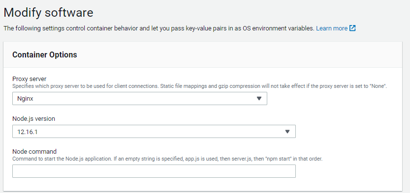
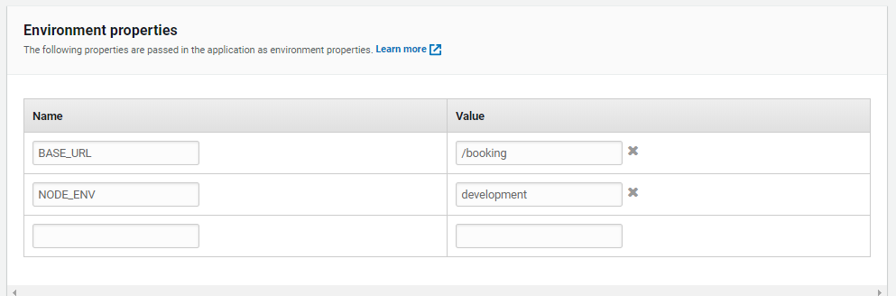

##AWS 

###Elastic Beanstalk

#### Setup

To configure the elastic beanstalk config (.elasticbeanstalk/config.yml) it's necessary to initialize the ebcli :

```eb init -i```

Note; you'll need to make sure the following profile is commented in the config.yml, or you won't be able to deploy ...


#### Environmental Dependencies


#### Environmental Variables



